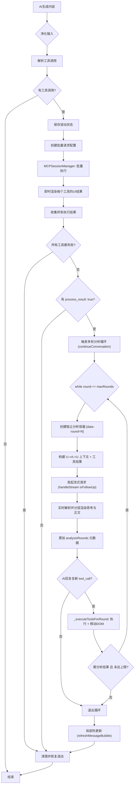

# MCP请求到渲染全流程文档 (v4.0)

## 概述

本文档详细描述了MCP（Model-Context-Protocol）功能从AI生成内容、前端解析工具调用，到最终在界面上渲染展示结果的完整流程。v4.0版本在v3.1基础上新增了**多轮工具调用**（最多10轮循环执行）、**per-round独立DOM容器**、**analysisRounds元数据**和**CSS order布局机制**。

**核心功能**：支持AI在一次回复中调用多个外部工具，并由前端并发执行、统一管理和优雅地渲染结果。v4.0支持AI根据前一轮工具结果发起新的工具调用，形成**链式多轮工具调用闭环**。

## 流程总览



## 详细流程说明

### 1. 输入处理与解析 (Input Handling & Parsing)

**入口**: `handleToolCalls` 函数 @ `js/services/mcp-handler.js`

1.  **接收内容**: 当AI的一条消息完整接收后，其最终内容 `content` 会被传入 `handleToolCalls` 函数。
2.  **净化输入**: 使用正则表达式移除 `<thinking>` 标签，防止干扰解析。
3.  **智能解析**: `parseToolCalls` 函数 (@ `js/mcp-core.js`) 支持解析单个工具调用对象或工具调用**数组**，兼容不同模型的输出格式。

### 2. 初次请求：批量执行与即时渲染

**核心**: `mcpSessionManager` & `mcp-renderer`

1.  **保存滚动状态**: 锁定当前视野。
2.  **批量执行**: 并发执行所有工具调用。
3.  **即时渲染**: 每个工具执行完毕后，立即调用 `renderToolCallResult` 将代码块转换为可视化的 UI 组件（如表格、卡片），无需等待所有任务完成。

### 3. 多轮工具调用循环 (v4.0 重大升级)

**核心**: `continueConversation` 函数 @ `js/services/llm-service.js`

> **⚠️ 关键架构**: `mcp-handler.js` 中 `continueConversationCallback` **不是 await 调用**（fire-and-forget），这意味着 `continueConversation` 与初始 `handleStream` 的 finally 块**并发执行**。所有 footer/collapse 按钮的视觉位置由 **CSS `order` 属性**无条件保证，不依赖 JS DOM 操作。

#### 3.1 循环引擎

```
while (round <= maxToolCallRounds) {
    1. 创建独立分析容器 [data-round=N]
    2. 构建上下文 + 发起流式请求
    3. 解析AI回复中的新 tool_call
    4. 执行工具 + 移动DOM到正确位置
    5. round++
}
```

- **最大轮次限制**: 由 `state.mcpSettings.maxToolCallRounds` 控制（默认10，可在设置中调整1~20）。
- **退出条件**: 无新 tool_call / 所有工具失败 / 达到上限 / AI未请求继续分析。

#### 3.2 上下文重构 (U -> A -> U)

为了让模型正确理解当前的对话状态，系统构建完整的历史链条：
*   **User**: 原始提问。
*   **Assistant**: 补全上一轮 AI 的回复（包含开场白和工具调用代码）。
*   **User**: 包含"[工具执行结果]"和"[分析任务]"的新消息。
*   每一轮的 AI 回复会追加到上下文中，供下一轮使用。

#### 3.3 Per-Round 独立 DOM 容器

每轮创建**独立**的分析容器和工具容器，DOM 结构如下：

```
.message-bubble
  ├── .message-content (初始AI文本)
  ├── .tool-calls-container (初始工具结果)
  ├── .analysis-result-container[data-round=1] (第1轮分析)
  ├── .tool-calls-container[data-round=2] (第1轮触发的工具)
  ├── .analysis-result-container[data-round=2] (第2轮分析)
  ├── .tool-calls-container[data-round=3] (第2轮触发的工具)
  ├── .message-footer (order: 998)     ← CSS强制底部
  └── .toggle-collapse-btn (order: 999) ← CSS强制底部
```

**`handleStream` 定位当前轮容器**: 使用 `querySelectorAll('.analysis-result-container')` 取**最后一个**（即当前轮次的），而非 `querySelector` 取第一个。

**`_executeToolsForRound` 工具块移位**: `renderToolCallResult` 仍将工具块放入全局 `.tool-calls-container`，然后 `_executeToolsForRound` 通过 `data-call-index` 查找并移动到 per-round 工具容器中，全局容器清空后移除。

#### 3.4 CSS Order 布局机制 (v4.0 新增)

```css
.message-bubble {
    display: flex;
    flex-direction: column;
}
.message-bubble > .message-footer { order: 998; }
.message-bubble > .toggle-collapse-btn { order: 999; }
```

**设计动机**: 多轮调用中，`handleStream` finally、`smartCollapseStateCheck`、`addCollapseButtonDuringStreaming`、`addOrUpdateMessageFooter` 等多个异步代码路径竞争修改 footer/collapse 位置。用 CSS `order` 属性**无条件**保证它们在视觉上始终在气泡底部，彻底消除 JS 时序竞争问题。

#### 3.5 结构化存储

*   **`analysisResult`**: 累加所有轮次的分析内容（分隔符 `---`）。
*   **`analysisReasoning`**: 累加所有轮次的思考内容。
*   **`analysisRounds`** (v4.0新增): 每轮的元数据数组，用于刷新时按轮次交错渲染：
    ```json
    [
      { "round": 1, "content": "...", "reasoning": "...", "toolCallStartIndex": 0, "toolCallCount": 2 },
      { "round": 2, "content": "...", "reasoning": "...", "toolCallStartIndex": 2, "toolCallCount": 1 }
    ]
    ```

#### 3.6 刷新渲染 (renderer.js)

`renderer.js` 的 `displayMessage` 中检测 `message.analysisRounds`：
- **有 analysisRounds**: 按轮次交错创建 analysis-result-container 和 tool-calls-container。
- **无 analysisRounds**: 退回旧逻辑（单个分析容器），兼容历史数据。

### 4. 最终处理：局部热更新 (Hot Swap)

**核心**: `refreshMessageBubble` @ `js/renderer.js`

为了解决流式输出过程中 DOM 结构可能产生的嵌套错乱（鬼畜现象）和白屏闪烁：

1.  **数据落盘**: 确保所有结果（工具数据、分析正文、思考内容）都已持久化到 `state` 和 IndexedDB。
2.  **外科手术式更新**: 调用 `refreshMessageBubble`，仅**销毁并重新创建当前这一条消息气泡**的 DOM 结构。
3.  **无感替换**: 利用 `replaceWith` 原地替换，且不触发全列表重绘，用户几乎感知不到闪烁，同时彻底修复了所有潜在的 DOM 状态不一致问题。

### 5. 工具调用申请条 (v3.1 新增)

**核心**: `createToolCallRequestBar` @ `markdown-worker.js` / `code-block-utils.js` / `code-block-enhancer.js`

AI 输出的 ` ```tool_call ` 代码块会被拦截并替换为紧凑的**紫色申请条**，而非显示原始 JSON 代码块。

1.  **三版本拦截**: Worker版(`markdown-worker.js`)、导出工具版(`code-block-utils.js`)、主线程版(`code-block-enhancer.js`) 的 `enhanceAllCodeBlocks` 中统一拦截 `language === 'tool_call'`。
2.  **JSON 解析 + 正则降级**: 先尝试 `JSON.parse` 提取工具名，失败时用正则 `"tool"\s*:\s*"([^"]+)"` 降级提取。解析前会清除 hljs 可能注入的 `<span>` 标签。
3.  **中文名匹配**: 在 `renderer.js` 的 `renderFormattedContent` 中，渲染后遍历 `.tool-call-request-item[data-tool-id]`，从 `DEFAULT_TOOLS` 注册表匹配中文名。
4.  **侧边栏展开**: 申请条内置隐藏的原始代码块。`code-block-enhancer.js` 和 `code-preview-manager.js` 支持从申请条展开到侧边栏查看原始 JSON。
5.  **流式渲染兼容**: `stream-renderer.js` 的 `updateDomPreservingCodeBlocks` 中检测结构类型变更——当旧节点从 `.code-block-container` 变为 `.tool-call-request-bar` 时，执行整体替换而非原地更新。

### 6. MCP 工具调用徽章 (v3.1 新增)

**核心**: `displayMessage` @ `renderer.js`

在 AI 消息的 sender-line 楼层号后追加 `🔧 ×N` 绿色徽章，显示该消息中 MCP 工具调用的数量。点击徽章会：
1. 展开折叠的消息（如果已折叠）
2. 平滑滚动到 `.tool-calls-container`

### 7. 折叠联动 (v3.1 新增)

**核心**: CSS 兄弟选择器 @ `mcp.css`

```css
.message-content.collapsible ~ .tool-calls-container { display: none !important; }
.message-content.expanded ~ .tool-calls-container { display: block !important; }
```

利用 `.message-content` 和 `.tool-calls-container` 的兄弟关系，纯 CSS 方案控制 MCP 结果块随消息折叠/展开同步显隐，彻底消除 JS 时序问题。

### 8. MCP 设置项 (v4.0 新增)

**核心**: `mcp-settings.js` + `modals.html`

在设置界面中新增"最大工具调用轮次"输入项（1~20，默认10），存储在 `state.mcpSettings.maxToolCallRounds`。AI 系统提示词中会告知当前允许的最大轮次。

## 关键数据结构变更

-   **`message.toolCalls`**: 存储所有轮次工具调用的执行结果数组（扁平结构）。
-   **`message.analysisResult`**: 累加存储所有轮次的分析正文（Markdown），各轮用 `---` 分隔。
-   **`message.analysisReasoning`**: 累加存储所有轮次的思考过程。
-   **`message.analysisRounds`** (v4.0新增): 每轮元数据数组 `[{round, content, reasoning, toolCallStartIndex, toolCallCount}]`，用于刷新时按轮次交错渲染。
-   **`state.mcpSettings.maxToolCallRounds`** (v4.0新增): 最大轮次限制，默认10。

## 模块职责更新

-   **`llm-service.js`** (v4.0重构，原 api.js 部分逻辑迁移):
    -   `continueConversation`: 多轮循环引擎，管理 while 循环、per-round 容器创建、上下文累积。
    -   `_executeToolsForRound`: 执行某一轮工具并将工具块从全局容器移到 per-round 容器。
    -   `_formatToolResults`: 格式化工具结果文本。
    -   `handleStream`: `isFollowUp` 模式下取最后一个分析容器渲染，finally 块跳过 footer 重建。
-   **`mcp-handler.js`**: `continueConversationCallback` 为 fire-and-forget（不 await），负责初始工具调用的执行和回调触发。
-   **`renderer.js`**:
    -   `displayMessage`: 检测 `analysisRounds` 按轮次交错渲染，向下兼容旧数据。
    -   `updateReasoningContainer`: 支持 `targetParent` 参数，实现思考内容的分层插入。
    -   `renderFormattedContent`: 渲染后匹配工具中文名。
    -   `refreshMessageBubble`: 实现单条消息的局部刷新。
-   **`mcp-settings.js`** (v4.0新增): 管理最大轮次设置的读写逻辑。
-   **`mcp-tools-selector.js`** (v4.0更新): 系统提示词中告知AI多轮调用能力和最大轮次。
-   **`mcp-core.js`**: 支持数组格式的工具调用解析。
-   **`markdown-worker.js`** / **`code-block-utils.js`** / **`code-block-enhancer.js`**: 拦截 tool_call 代码块，替换为工具调用申请条。
-   **`stream-renderer.js`**: 处理流式渲染中代码块到申请条的结构类型变更。
-   **`code-preview-manager.js`**: 支持从申请条展开原始 JSON 到侧边栏。
-   **`mcp-renderer.js`**: 创建 `.tool-calls-container` 时同步检查消息折叠状态。
-   **`chat.css`** (v4.0新增): `.message-bubble` 使用 `flex-direction: column` + `order` 属性强制 footer/collapse 在底部。
-   **`mcp.css`** (v4.0新增): `.analysis-header` 蓝色渐变样式、`.mcp-round-indicator` 轮次指示器。