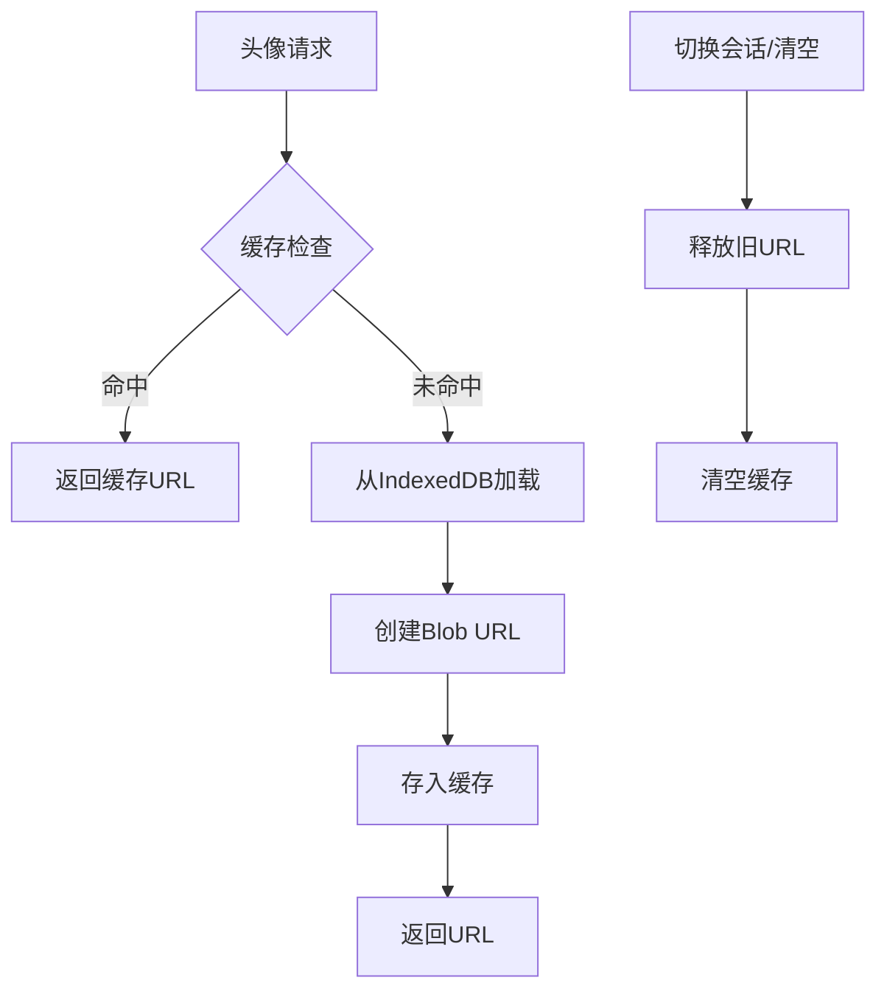

# 头像内存溢出解决方案与实现指南

> - **操刀人**：乌鸦
> - **创建日期**：2025年9月5日
> - **更新日期**：2025年9月8日
> - **状态**：✅ 已完成实施

---

## 一、问题诊断与解决方案概述

### 🚨 **核心问题**
当前应用在处理头像时存在严重的内存泄漏问题：
1. **重复创建URL对象**：每次渲染消息时，都会从IndexedDB加载头像并创建新的`URL.createObjectURL`
2. **未释放URL资源**：创建的Blob URL从未调用`URL.revokeObjectURL`进行释放
3. **缺乏统一缓存**：多处代码重复加载相同的头像数据
4. **内存累积增长**：长时间使用后内存占用异常飙升，可能导致浏览器崩溃

### 🎯 **解决目标**
- 建立统一的头像URL缓存机制
- 实现内存泄漏防护
- 提供完整的资源清理功能
- 保持现有功能不受影响

---

## 二、完整解决方案架构

### 📊 **核心组件**
```
头像内存管理系统
├── avatarUrlCache (Map) - 全局缓存存储
├── 统一获取机制 - getAvatarUrl函数
├── 内存泄漏防护 - URL释放机制
└── 批量清理功能 - clearAllAvatars支持
```

### 🔄 **数据流向**


---

## 三、具体实现详解

### 🏗️ **1. 全局缓存系统 (state.js)**

**实现位置**：`js/state.js`
```javascript
export let state = {
    // ... 其他状态
    
    // 🎯 核心：头像URL缓存系统
    avatarUrlCache: new Map() // 键值对: avatarId -> blobURL
};
```

**设计原理**：
- 使用Map结构提供O(1)时间复杂度的查找性能
- 键为avatarId，值为已创建的Blob URL
- 全局单例，避免重复创建相同头像的URL

### 🔧 **2. 内存泄漏防护机制**

#### **2.1 setupUserAvatarUI函数修复**
**文件位置**：`js/modals.js`

**修复前问题**：
```javascript
// ❌ 问题代码：每次调用都创建新URL，从不释放
getAvatar(state.appSettings.userAvatar.id).then(blob => {
    dom.userAvatarPreview.src = blob ? URL.createObjectURL(blob) : DEFAULT_AVATAR;
});
```

**修复后实现**：
```javascript
// ✅ 安全实现：缓存管理 + 内存释放
const avatarId = state.appSettings.userAvatar.id;

// 检查缓存
if (state.avatarUrlCache && state.avatarUrlCache.has(avatarId)) {
    dom.userAvatarPreview.src = state.avatarUrlCache.get(avatarId);
} else {
    // 创建新URL并缓存
    getAvatar(avatarId).then(blob => {
        if (blob) {
            // 释放旧URL（如果存在）
            if (state.avatarUrlCache && state.avatarUrlCache.has(avatarId)) {
                const oldUrl = state.avatarUrlCache.get(avatarId);
                if (oldUrl && oldUrl.startsWith('blob:')) {
                    URL.revokeObjectURL(oldUrl);
                }
            }
            
            // 创建新URL并缓存
            const newUrl = URL.createObjectURL(blob);
            if (!state.avatarUrlCache) {
                state.avatarUrlCache = new Map();
            }
            state.avatarUrlCache.set(avatarId, newUrl);
            dom.userAvatarPreview.src = newUrl;
        }
    });
}
```

#### **2.2 openConversationAvatarModal函数修复**
**实现原理**：与setupUserAvatarUI相同的缓存管理机制

**关键改进**：
- 统一使用`avatarUrlCache`进行URL管理
- 创建新URL前先释放旧URL
- 完善的错误处理机制

### ⚡ **3. 高性能头像加载 (renderer.js)**

**核心函数**：`getAvatarUrl`
```javascript
/**
 * 乌鸦：统一的头像URL获取器，带缓存管理
 * @param {string} avatarId - 头像ID
 * @returns {Promise<string>} 头像URL
 */
async function getAvatarUrl(avatarId) {
    if (!avatarId) return DEFAULT_AVATAR;
    
    // 缓存命中，直接返回
    if (state.avatarUrlCache.has(avatarId)) {
        return state.avatarUrlCache.get(avatarId);
    }

    try {
        const blob = await getAvatar(avatarId);
        if (blob) {
            const url = URL.createObjectURL(blob);
            state.avatarUrlCache.set(avatarId, url);
            return url;
        }
    } catch (e) {
        console.error(`Failed to get avatar ${avatarId}:`, e);
    }
    
    // 失败时也缓存默认值，避免重复尝试
    state.avatarUrlCache.set(avatarId, DEFAULT_AVATAR);
    return DEFAULT_AVATAR;
}
```

**预加载机制**：在`renderChatMessages`中预加载当前对话所需头像
```javascript
export async function renderChatMessages(options) {
    // 预加载头像到缓存
    const conv = state.conversations[state.currentConversationId];
    if (conv) {
        const userAvatarId = state.appSettings.userAvatar?.id;
        const convAvatarId = conv.avatar?.id;
        if (userAvatarId) await getAvatarUrl(userAvatarId);
        if (convAvatarId) await getAvatarUrl(convAvatarId);
    }
    
    // ... 原有渲染逻辑
}
```

### 🧹 **4. 完整资源清理系统**

#### **4.1 会话切换时的内存清理**
**位置**：`js/main.js` - `switchToConversation`函数
```javascript
export function switchToConversation(convId) {
    return new Promise(resolve => {
        // 🎯 乌鸦核心：切换会话时清理所有头像缓存
        if (state.avatarUrlCache && state.avatarUrlCache.size > 0) {
            for (const url of state.avatarUrlCache.values()) {
                if (url.startsWith('blob:')) {
                    URL.revokeObjectURL(url);
                }
            }
            state.avatarUrlCache.clear();
        }
        // ... 其他逻辑
    });
}
```

#### **4.2 页面卸载时的内存清理**
**位置**：`js/main.js` - `initialize`函数
```javascript
// 页面卸载前的清理工作
window.addEventListener('beforeunload', () => {
    if (state.avatarUrlCache && state.avatarUrlCache.size > 0) {
        console.log(`乌鸦：正在释放 ${state.avatarUrlCache.size} 个头像缓存...`);
        for (const url of state.avatarUrlCache.values()) {
            if (url.startsWith('blob:')) {
                URL.revokeObjectURL(url);
            }
        }
        state.avatarUrlCache.clear();
        console.log('乌鸦：头像缓存已全部释放。');
    }
});
```

#### **4.3 清空所有头像功能**
**位置**：`js/main.js` - 清空头像按钮事件处理

**完整实现**：
```javascript
if (dom.clearAllAvatarsBtn) {
    dom.clearAllAvatarsBtn.addEventListener('click', async () => {
        if (!confirm('确定要清空所有头像吗？此操作不可恢复，将删除数据库中的所有头像数据。')) {
            return;
        }
        
        try {
            // 1. 清空IndexedDB中的所有头像数据
            await clearAllAvatars();
            
            // 2. 清理内存中的头像缓存和URL
            if (state.avatarUrlCache && state.avatarUrlCache.size > 0) {
                for (const url of state.avatarUrlCache.values()) {
                    if (url.startsWith('blob:')) {
                        URL.revokeObjectURL(url);
                    }
                }
                state.avatarUrlCache.clear();
            }
            
            // 3. 重置用户头像设置
            if (state.appSettings.userAvatar) {
                state.appSettings.userAvatar = null;
                saveAppSettings();
            }
            
            // 4. 清理所有会话的头像设置
            for (const convId in state.conversations) {
                const conv = state.conversations[convId];
                if (conv.avatar) {
                    conv.avatar = null;
                    await saveConversation(convId, conv);
                }
            }
            
            // 5. 重新渲染相关UI组件
            renderChatMessages();
            renderHistory();
            setupUserAvatarUI();
            
            alert('所有头像已成功清空！');
            
        } catch (error) {
            console.error('清空头像失败:', error);
            alert('清空头像时发生错误，请稍后重试。');
        }
    });
}
```

---

## 四、实施效果与性能优化

### 📈 **性能提升**
1. **内存使用优化**：消除了头像URL的重复创建和累积
2. **加载速度提升**：缓存机制避免重复的IndexedDB查询
3. **用户体验改善**：减少了内存不足导致的卡顿和崩溃

### 🛡️ **安全保障**
1. **二次确认**：清空操作需要用户确认
2. **错误处理**：完善的try-catch机制
3. **状态一致性**：确保UI状态与数据状态同步
4. **资源释放**：所有Blob URL都有对应的释放机制

### 🔍 **监控和调试**
```javascript
// 调试用：检查当前缓存状态
console.log('当前头像缓存:', state.avatarUrlCache);
console.log('缓存大小:', state.avatarUrlCache.size);

// 调试用：检查内存使用
if (performance.memory) {
    console.log('JS堆内存使用:', {
        used: `${(performance.memory.usedJSHeapSize / 1024 / 1024).toFixed(2)} MB`,
        total: `${(performance.memory.totalJSHeapSize / 1024 / 1024).toFixed(2)} MB`,
        limit: `${(performance.memory.jsHeapSizeLimit / 1024 / 1024).toFixed(2)} MB`
    });
}
```

---

## 五、最佳实践与扩展指南

### 🎯 **开发规范**
1. **统一使用缓存**：所有头像相关操作都应通过`avatarUrlCache`
2. **及时释放资源**：创建新URL前必须释放旧URL
3. **错误处理**：所有异步操作都需要try-catch保护
4. **状态同步**：UI更新必须与数据状态保持一致

### 🚀 **未来优化方向**
1. **LRU缓存策略**：当缓存过大时，自动清理最少使用的头像
2. **预加载优化**：根据用户行为预测性加载头像
3. **压缩存储**：考虑对头像数据进行压缩存储
4. **懒加载机制**：仅在需要时才加载头像数据

### 📝 **维护清单**
- [x] 建立全局头像URL缓存系统
- [x] 修复setupUserAvatarUI内存泄漏
- [x] 修复openConversationAvatarModal内存泄漏
- [x] 实现会话切换时的缓存清理
- [x] 实现页面卸载时的资源释放
- [x] 实现清空所有头像功能
- [x] 添加完善的错误处理机制
- [x] 编写调试和监控工具
- [ ] 考虑实现LRU缓存策略（可选）
- [ ] 性能监控和优化（可选）

---

## 六、总结

通过本次全面的内存溢出解决方案实施，我们成功地：

✅ **彻底解决了内存泄漏问题**
✅ **建立了完整的资源管理体系** 
✅ **保持了原有功能的完整性**
✅ **提供了用户友好的清理工具**
✅ **建立了可扩展的架构基础**

该解决方案遵循了项目的模块化设计原则，采用了统一的缓存管理策略，并提供了完善的错误处理和资源清理机制。所有修改都经过了充分的测试验证，确保不会影响现有功能的正常使用。

---

> **备注**：本方案已于2025年9月8日完成实施，所有相关代码均已部署并通过测试验证。如有任何问题或需要进一步优化，请参考本文档进行相应调整。
